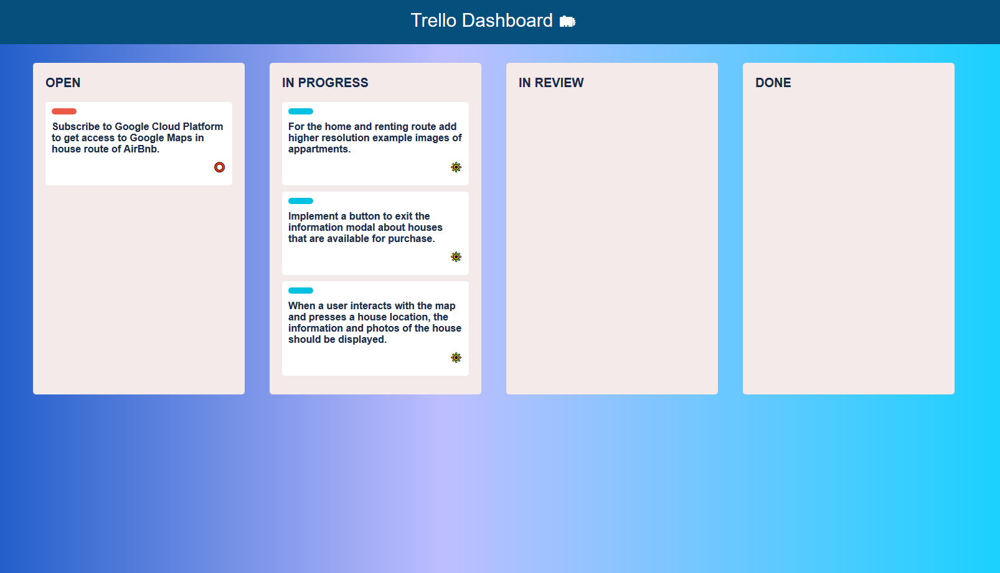

# React Drag n Drop

Trello Dashboard in ReactJS.

## Installation

Use the cmd line to install dependencies.

```
npm install
```

## Usage

```
npm run build
npm run dev
Open up localhost:4000 in the browser
```

## Preview




## Solves a babel/webpack issue

```
npm install -D babel-loader @babel/core @babel/preset-env webpack
```
